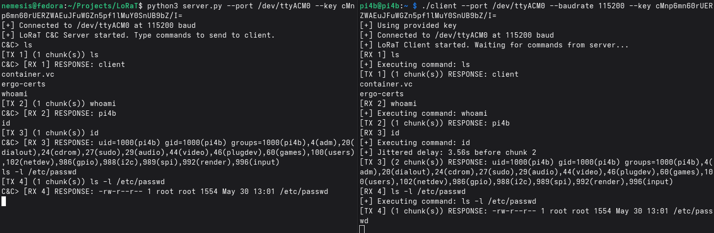

# LoRaT

## A stealthy RAT that uses encrypted long-range radio signals for C&C operations

## Description

A LoRa-based Remote Access Trojan (RAT) that uses long-range, low-power radio signals for command-and-control (C&C) operations is inherently stealthy. Unlike traditional malware that depends on internet or Wi-Fi networks, this RAT transmits short, intermittent bursts of encrypted data at low power, minimizing detectable signatures. Its reliance on sub-gigahertz radio frequencies (typically 868 MHz or 915 MHz) further reduces visibility to conventional security monitoring tools, which are primarily designed to detect network-based threats.

## Supported LoRa module(s):

- LilyGo T3 V1.6.1 868MHz

## Software Requirements

- Arduino IDE
- Python 3.6+

## Features

- Works well on air-gapped systems unless faraday cage or jammers are used
- Encrypted communication using AES-256-CBC
- Client is ported in C and works well without external dependencies
- Undetectable by most IDS & AV solutions
- Tested working at 800m~ range

## Installation

    sudo apt install git libssl-dev gcc
    git clone https://github.com/umutcamliyurt/LoRaT.git
    cd LoRaT/
    pip3 install -r requirements.txt
    gcc -O2 -Wall -pthread client.c -o client -static -lssl -lcrypto -lpthread -ldl

### Firmware Installation

1. Open the firmware file in Arduino IDE

2. Install required libraries:
    - LoRa by Sandeep Mistry
    - Adafruit GFX Library
    - Adafruit SSD1306

3. Upload the firmware

(At least 2 LoRa modules are required for C&C)

### Server:

    python3 server.py --port /dev/ttyACM0 --key <base64-aes256-key>

### Client:

    python3 client.py --port /dev/ttyACM0 --key <base64-aes256-key>

#### C port:

    ./client --port /dev/ttyACM0 [--baudrate 115200] [--key <base64-aes256-key>]

## Screenshots

## License

Distributed under the MIT License. See `LICENSE` for more information.